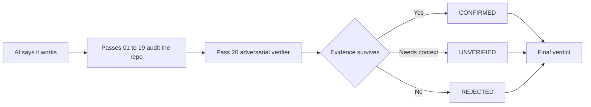

<p align="center">
  
</p>

<p align="center">
  
</p>
<p align="center">
  <strong>CLI ohne Installation:</strong> init → doctor → prompt
</p>

<p align="center">
  <strong>20 adversariale Passes zwischen „läuft“ und „kann ausgeliefert werden“.</strong><br/>
  Sicherheit · Korrektheit · Zuverlässigkeit · Skalierung
</p>

<p align="center">
  <strong>Languages:</strong>
  <a href="README.md">English</a> ·
  <a href="README.tr.md">Türkçe</a> ·
  <a href="README.zh-CN.md">简体中文</a> ·
  <a href="README.pt-BR.md">Português (Brasil)</a> ·
  <a href="README.ja.md">日本語</a> ·
  <a href="README.es.md">Español</a> ·
  <a href="README.ko.md">한국어</a> ·
  <a href="README.de.md">Deutsch</a>
</p>

<p align="center">
  <a href="https://www.npmjs.com/package/vibebreaker"></a>
  <a href="https://www.npmjs.com/package/vibebreaker"></a>
  <a href="https://github.com/digitaldonusum/vibebreaker/stargazers"></a>
  <a href="LICENSE"></a>
  
</p>

<p align="center">
  <strong>Deine KI sagt „es funktioniert“. Lass sie es beweisen.</strong>
</p>

<p align="center">
  VibeBreaker ist ein agent-agnostisches, evidenzbasiertes Audit-Protokoll für AI-/vibe-coded Software.<br/>
  Es prüft ein Repository aus 20 unterschiedlichen Failure-Angles und nutzt anschließend einen adversarial verifier, um false positives auszusortieren.
</p>

---

## ⚡ Mit einem Befehl starten

```bash
npx vibebreaker init
```

<p align="center">
  <strong>20 passes. One verifier. No vibes. Evidence.</strong>
</p>

### Quick start

```bash
npx vibebreaker init
npx vibebreaker doctor
npx vibebreaker prompt
```

| Command | Funktion |
|---|---|
| `init` | Erstellt einen lokalen `.vibebreaker/` Workspace mit Protokoll, allen 20 Passes, Templates und Agent-Prompt |
| `doctor` | Prüft, ob der lokale Audit-Workspace vollständig ist |
| `prompt` | Gibt die exakte Anweisung für deinen Coding Agent aus |

> **Privacy by design:** VibeBreaker wählt nicht heimlich ein Modell aus und sendet deinen Source Code nicht an eine Drittanbieter-API. Der Workflow bleibt agent-agnostic.

---

## Von „läuft“ zu Evidenz

| 01 — Attack | 02 — Verify | 03 — Decide |
|---|---|---|
| 19 fokussierte Passes prüfen Security, Reliability, Data und Scale. | Pass 20 versucht jeden candidate finding **zu widerlegen**. | Nur findings mit belastbarer Evidenz landen im finalen verdict. |
| Findet Injection, IDOR, race conditions, N+1, leaks, retry bugs und mehr. | Fehlende Evidenz wird rejected oder bleibt `UNVERIFIED`. | `BROKEN`, `FIX BEFORE SHIP`, `SURVIVED*` oder `20/20 CLEAN`. |



---

## Das 20-Pass Protocol

| | | | |
|---|---|---|---|
| **01** Injection | **02** Authentication | **03** Authorization / IDOR | **04** Secrets |
| **05** Failure Paths | **06** Race Conditions | **07** Resource Leaks | **08** N+1 / Data Access |
| **09** Complexity | **10** Memory Growth | **11** Timeouts / Resilience | **12** Idempotency |
| **13** Transactions | **14** Config Hardening | **15** Supply Chain | **16** Observability |
| **17** API Contracts | **18** Cross-Module Risk | **19** Test Gaps | **20** Adversarial Verification |

<details>
<summary><strong>Was jeder Pass sucht</strong></summary>

| # | Pass | Failure class |
|---:|---|---|
| 01 | Injection & Untrusted Input | Unsichere Pfade von externem Input zu gefährlichen Sinks |
| 02 | Authentication & Sessions | Identity Establishment, Rotation, Recovery und Invalidation |
| 03 | Authorization & IDOR | Fehlendes Ownership-, Tenant-, Role- oder Object-Level-Enforcement |
| 04 | Secrets & Sensitive Data | Leakage von Credentials, PII, Debug-Daten und Responses |
| 05 | Failure Paths | Partial Writes, swallowed errors und fehlende Compensation |
| 06 | Concurrency & Races | Check-then-act und nicht-atomare State Transitions |
| 07 | Resource Lifecycle | Leaks bei Connections, Files, Locks, Timern und Listeners |
| 08 | Data Access & N+1 | Query Fan-out, unbounded reads und vermeidbare In-Memory-Arbeit |
| 09 | Complexity & Hot Paths | Unbeabsichtigtes O(n²), wiederholte teure Arbeit und Scale Cliffs |
| 10 | Memory Growth | Unbounded Caches, Queues, retained graphs und Datasets |
| 11 | Timeouts & Resilience | External Calls, Retry Policy, Backoff und Failure Behavior |
| 12 | Idempotency | Duplicate Delivery, doppelte Effects und Retry Safety |
| 13 | Consistency Boundaries | Transactions, Outbox/Saga/Compensation und inkonsistenter State |
| 14 | Config Hardening | Gefährliche Defaults und Environment Drift |
| 15 | Supply Chain | Dependency Exposure und Install-Time Risk |
| 16 | Observability | Diagnostic Blind Spots und fehlende Audit Trails |
| 17 | API Contracts | Inkonsistente Errors, Pagination, Nullability und Semantics |
| 18 | Cross-Module Contracts | Responsibility Gaps und emergente Fehler zwischen Modulen |
| 19 | Test Gaps | Fehlende High-Impact-Szenarien und schwache Assertions |
| 20 | Adversarial Verification | Findings erneut lokalisieren, widerlegen, deduplizieren und konservativ neu bewerten |

</details>

---

## Pass 20 ist der Unterschied

Viele AI-Audits sind gut darin, *mögliche* Probleme zu produzieren. VibeBreaker ist so gebaut, dass unbelegte Behauptungen schwer bis ins Endergebnis überleben.

Pass 20 erhält alle candidate findings und muss ausdrücklich:

- **keine neuen findings hinzufügen**
- jeden referenzierten Codepfad erneut lokalisieren
- Guards, Constraints, Policies, Transactions und Framework Behavior suchen, die das Problem widerlegen
- duplicate findings aus unterschiedlichen Passes zusammenführen
- Aussagen, die von nicht gesehenem Code abhängen, als `UNVERIFIED` belassen
- `CRITICAL` nur für konkrete, reachable und materiell schädliche Fehler reservieren

Der finale Output kennt nur drei Finding-States:

| Status | Bedeutung |
|---|---|
| `CONFIRMED` | Die Evidenz hat adversarial verification überstanden |
| `UNVERIFIED` | Mehr Code, Config oder Runtime Context ist nötig |
| `REJECTED` | Der Finding wurde widerlegt, dedupliziert oder war nicht ausreichend belegt |

---

## Final verdict

| Verdict | Regel |
|---|---|
| 🔴 `BROKEN` | Mindestens ein confirmed `CRITICAL` |
| 🟠 `FIX BEFORE SHIP` | Keine criticals, aber mindestens ein confirmed `HIGH` |
| 🟡 `SURVIVED*` | Keine critical/high; niedrigere Severity oder unresolved findings bleiben |
| 🟢 `20/20 CLEAN` | `FULL` Audit, zero confirmed, zero unverified und keine wesentliche Scope-Limitation |

<p align="center">
  
</p>

> `20/20 CLEAN` bedeutet **nicht „für immer sicher“**. Es bedeutet, dass innerhalb des geprüften Codes und des verfügbaren Kontexts kein Finding das Protokoll überstanden hat.

---

## The 20/20 Challenge

Glaubst du, deine vibe-coded App ist wirklich ship-ready?

Führe alle 20 Passes aus und lass Pass 20 versuchen, die Findings auseinanderzunehmen.

**20/20 clean? Prove it.**

- Teile deine Result Card
- Öffne ein [`20/20 Challenge` Issue](.github/ISSUE_TEMPLATE/share-result.yml)
- Tagge das Projekt, wenn du dein Ergebnis veröffentlichst

---

## Audit modes

| Mode | Passes | Geeignet für |
|---|---|---|
| `FULL` | 01–20 | Erster Launch, Major Release, ernsthafte Review |
| `QUICK` | 01, 02, 03, 04, 11, 12, 13, 19, 20 | Schnelle Pre-Deploy-Review |
| `DIFF` | Applicable passes + 20 | Pull Requests und agent-generated changes |
| `FOCUS:<area>` | Selected passes + 20 | Auth, Data, Performance, Resilience usw. |

---

## Evidence contract

Jeder candidate finding muss die exakte Code-Location, den Failure Path und die Verification Method nennen. Kein `file:line`, keine selbstsichere Behauptung.

<details>
<summary><strong>Finding example</strong></summary>

```yaml
id: P03-F02
pass: "03"
title: Cross-tenant project access
status: CANDIDATE
severity: HIGH
confidence: HIGH
location:
  - path: src/api/projects/[id]/route.ts
    line: 47-62
entry_or_trigger: GET /api/projects/:id
evidence: Project is fetched using only a caller-supplied object id.
existing_controls_checked: Authentication exists; no owner or tenant scope was found.
failure_scenario: User A supplies User B's project id and receives B's project.
impact: Cross-tenant data disclosure.
remediation_direction: Scope the lookup to the authenticated principal/tenant.
verification: Request another tenant's project id and assert 403/404.
needs_context: null
```

</details>

---

## Manuell ausführen

<details>
<summary><strong>CLI nicht verwenden?</strong></summary>

Gib deinem Coding Agent das VibeBreaker-Repository oder kopiere die Protokolldateien in dein Projekt und verwende folgende Anweisung:

```text
Run the full VibeBreaker 20-Pass Protocol defined in AUDIT_PROTOCOL.md.
Stay read-only. Execute passes 01 through 20 in order.
Write raw pass results under .vibebreaker/raw/ and the final report to .vibebreaker/FINAL_REPORT.md.
Do not fix anything until the final report is complete.
Pass 20 is the adversarial verifier and is the only pass allowed to finalize finding status.
```

Funktioniert mit jedem Coding Agent, der ein Repository inspizieren und Markdown-Anweisungen befolgen kann.

</details>

---

## Empfohlener Workflow

```text
BUILD
  ↓
VIBEBREAKER AUDIT     ← read-only
  ↓
PASS 20 VERIFICATION
  ↓
FINAL REPORT
  ↓
FIX PLAN
  ↓
FIX
  ↓
RE-RUN RELEVANT PASSES
```

**Review first. Repair second.** Lass den Auditing Agent nicht still Code verändern, solange er noch Evidenz sammelt.

---

## Was VibeBreaker nicht ist

VibeBreaker **ersetzt nicht** SAST/SCA/DAST, professionelle Pentests, Load Testing oder Production Monitoring. Es ist ein diszipliniertes White-Box-Review-Protokoll für Coding Agents.

Prüfe nur Software, die dir gehört oder für die du ausdrücklich autorisiert bist.

---

<details>
<summary><strong>Repository map</strong></summary>

```text
vibebreaker/
├── bin/                     # CLI entrypoint
├── src/                     # CLI implementation
├── test/                    # Node tests
├── README.md
├── README.tr.md
├── AGENTS.md
├── AUDIT_PROTOCOL.md
├── PROMPT_PACK.md
├── BRAND.md
├── CHALLENGE.md
├── prompts/                 # 20 focused passes
├── templates/               # finding + final report contracts
├── assets/                  # hero, badge, result-card assets
└── .github/ISSUE_TEMPLATE/  # community result sharing
```

</details>

## Contributing

Der wertvollste Beitrag ist eine Failure Class, die einen echten Production Bug erzeugen kann und sich als evidenzbasierte Audit-Regel ausdrücken lässt, ohne false positives unnötig aufzublähen. Siehe [`CONTRIBUTING.md`](CONTRIBUTING.md).

## Lizenz

MIT

---

<p align="center">
  <strong>Deine KI sagt „es funktioniert“. Lass sie es beweisen.</strong><br/>
  <sub>Wenn VibeBreaker das erste echte Problem findet, das deine KI übersehen hat, kannst du dem Repository gerne einen Star geben.</sub>
</p>
