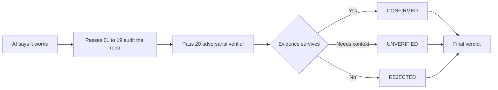

<p align="center">
  
</p>

<p align="center">
  
</p>
<p align="center">
  <strong>CLI sin instalación:</strong> init → doctor → prompt
</p>

<p align="center">
  <strong>20 pases adversariales entre “funciona” y “listo para producción”.</strong><br/>
  Seguridad · Corrección · Fiabilidad · Escala
</p>

<p align="center">
  <strong>Languages:</strong>
  <a href="README.md">English</a> ·
  <a href="README.tr.md">Türkçe</a> ·
  <a href="README.zh-CN.md">简体中文</a> ·
  <a href="README.pt-BR.md">Português (Brasil)</a> ·
  <a href="README.ja.md">日本語</a> ·
  <a href="README.es.md">Español</a> ·
  <a href="README.ko.md">한국어</a> ·
  <a href="README.de.md">Deutsch</a>
</p>

<p align="center">
  <a href="https://www.npmjs.com/package/vibebreaker"></a>
  <a href="https://www.npmjs.com/package/vibebreaker"></a>
  <a href="https://github.com/digitaldonusum/vibebreaker/stargazers"></a>
  <a href="LICENSE"></a>
  
</p>

<p align="center">
  <strong>Tu IA dijo “funciona”. Haz que lo demuestre.</strong>
</p>

<p align="center">
  VibeBreaker es un protocolo de auditoría agnóstico al agent y centrado en evidencia para software creado con IA / vibe coding.<br/>
  Ataca un repositorio desde 20 clases de fallo distintas y usa un adversarial verifier final para eliminar false positives.
</p>

---

## ⚡ Empieza con un comando

```bash
npx vibebreaker init
```

<p align="center">
  <strong>20 passes. Un verifier. Sin vibes. Evidencia.</strong>
</p>

### Quick start

```bash
npx vibebreaker init
npx vibebreaker doctor
npx vibebreaker prompt
```

| Comando | Qué hace |
|---|---|
| `init` | Crea un workspace `.vibebreaker/` local con el protocolo, los 20 passes, templates y el prompt del agent |
| `doctor` | Verifica que el workspace de auditoría esté completo |
| `prompt` | Imprime la instrucción exacta para entregar a tu coding agent |

> **Privado por diseño:** VibeBreaker no elige silenciosamente un modelo ni envía tu código fuente a una API de terceros. El flujo sigue siendo agent-agnostic.

---

## De “funciona” a evidencia

| 01 — Attack | 02 — Verify | 03 — Decide |
|---|---|---|
| Ejecuta 19 passes enfocados en seguridad, fiabilidad, datos y escala. | Pass 20 intenta **refutar** cada finding candidato. | Solo los findings respaldados por evidencia llegan al verdict final. |
| Busca injection, IDOR, race conditions, N+1, leaks, retry bugs y más. | La evidencia insuficiente se rechaza o queda como `UNVERIFIED`. | `BROKEN`, `FIX BEFORE SHIP`, `SURVIVED*` o `20/20 CLEAN`. |



---

## El 20-Pass Protocol

| | | | |
|---|---|---|---|
| **01** Injection | **02** Authentication | **03** Authorization / IDOR | **04** Secrets |
| **05** Failure Paths | **06** Race Conditions | **07** Resource Leaks | **08** N+1 / Data Access |
| **09** Complexity | **10** Memory Growth | **11** Timeouts / Resilience | **12** Idempotency |
| **13** Transactions | **14** Config Hardening | **15** Supply Chain | **16** Observability |
| **17** API Contracts | **18** Cross-Module Risk | **19** Test Gaps | **20** Adversarial Verification |

<details>
<summary><strong>Ver qué busca cada pass</strong></summary>

| # | Pass | Clase de fallo |
|---:|---|---|
| 01 | Injection & Untrusted Input | Rutas inseguras desde input externo hasta sinks peligrosos |
| 02 | Authentication & Sessions | Establecimiento, rotación, recuperación e invalidación de identidad |
| 03 | Authorization & IDOR | Falta de ownership, tenant, role o enforcement a nivel de objeto |
| 04 | Secrets & Sensitive Data | Filtración de credenciales, PII, debug y respuestas |
| 05 | Failure Paths | Escrituras parciales, errores tragados y compensación ausente |
| 06 | Concurrency & Races | Check-then-act y transiciones de estado no atómicas |
| 07 | Resource Lifecycle | Leaks de conexiones, archivos, locks, timers y listeners |
| 08 | Data Access & N+1 | Query fan-out, lecturas sin límite y trabajo innecesario en memoria |
| 09 | Complexity & Hot Paths | O(n²) accidental, trabajo caro repetido y cliffs de escala |
| 10 | Memory Growth | Caches, colas, grafos y datasets sin límite |
| 11 | Timeouts & Resilience | Llamadas externas, retry policy, backoff y comportamiento ante fallos |
| 12 | Idempotency | Entrega duplicada, efectos dobles y retry safety |
| 13 | Consistency Boundaries | Transactions, outbox/saga/compensation y estado inconsistente |
| 14 | Config Hardening | Defaults peligrosos y drift de entorno |
| 15 | Supply Chain | Exposición de dependencias y riesgo en install-time |
| 16 | Observability | Puntos ciegos de diagnóstico y falta de audit trail |
| 17 | API Contracts | Errores, paginación, nullability y semántica inconsistentes |
| 18 | Cross-Module Contracts | Huecos de responsabilidad y fallos emergentes entre módulos |
| 19 | Test Gaps | Escenarios de alto impacto ausentes y assertions débiles |
| 20 | Adversarial Verification | Relocalizar, refutar, deduplicar y revaluar de forma conservadora |

</details>

---

## Pass 20 es la diferencia

La mayoría de auditorías con IA son buenas produciendo problemas *posibles*. VibeBreaker está diseñado para que una afirmación sin evidencia tenga difícil sobrevivir.

Pass 20 recibe todos los findings candidatos y debe:

- **no añadir nuevos findings**
- relocalizar cada ruta de código citada
- buscar guards, constraints, policies, transactions y comportamiento del framework que refuten el problema
- fusionar findings duplicados de distintos passes
- mantener como `UNVERIFIED` aquello que dependa de código no inspeccionado
- reservar `CRITICAL` para fallos concretos, alcanzables y materialmente graves

El resultado final solo tiene tres estados:

| Status | Significado |
|---|---|
| `CONFIRMED` | La evidencia sobrevivió a la verificación adversarial |
| `UNVERIFIED` | Se necesita más código, config o contexto de runtime |
| `REJECTED` | El finding fue refutado, duplicado o no tenía evidencia suficiente |

---

## Verdict final

| Verdict | Regla |
|---|---|
| 🔴 `BROKEN` | Al menos un `CRITICAL` confirmado |
| 🟠 `FIX BEFORE SHIP` | Sin criticals, pero al menos un `HIGH` confirmado |
| 🟡 `SURVIVED*` | Sin critical/high; quedan findings menores o no resueltos |
| 🟢 `20/20 CLEAN` | Audit `FULL`, cero confirmed, cero unverified y sin limitaciones materiales de scope |

<p align="center">
  
</p>

> `20/20 CLEAN` **no significa “seguro para siempre”**. Significa que ningún finding sobrevivió al protocolo dentro del código y contexto inspeccionados.

---

## The 20/20 Challenge

¿Crees que tu app vibe-coded está lista para producción?

Ejecuta los 20 passes y deja que Pass 20 intente desmontar los findings.

**¿20/20 clean? Demuéstralo.**

- Comparte tu result card
- Abre una issue [`20/20 Challenge`](.github/ISSUE_TEMPLATE/share-result.yml)
- Etiqueta el proyecto cuando compartas tu resultado

---

## Modos de auditoría

| Modo | Passes | Ideal para |
|---|---|---|
| `FULL` | 01–20 | Primer lanzamiento, major release, revisión seria |
| `QUICK` | 01, 02, 03, 04, 11, 12, 13, 19, 20 | Revisión rápida pre-deploy |
| `DIFF` | Passes aplicables + 20 | Pull requests y cambios generados por agents |
| `FOCUS:<area>` | Passes seleccionados + 20 | Auth, data, performance, resilience, etc. |

---

## Contrato de evidencia

Cada finding candidato debe indicar la ubicación exacta en código, el failure path y el método de verificación. Sin `file:line`, no hay afirmación de alta confianza.

<details>
<summary><strong>Ejemplo de finding</strong></summary>

```yaml
id: P03-F02
pass: "03"
title: Cross-tenant project access
status: CANDIDATE
severity: HIGH
confidence: HIGH
location:
  - path: src/api/projects/[id]/route.ts
    line: 47-62
entry_or_trigger: GET /api/projects/:id
evidence: Project is fetched using only a caller-supplied object id.
existing_controls_checked: Authentication exists; no owner or tenant scope was found.
failure_scenario: User A supplies User B's project id and receives B's project.
impact: Cross-tenant data disclosure.
remediation_direction: Scope the lookup to the authenticated principal/tenant.
verification: Request another tenant's project id and assert 403/404.
needs_context: null
```

</details>

---

## Ejecutarlo manualmente

<details>
<summary><strong>¿No quieres usar la CLI?</strong></summary>

Entrega el repositorio de VibeBreaker a tu coding agent o copia los archivos del protocolo al proyecto y dale esta instrucción:

```text
Run the full VibeBreaker 20-Pass Protocol defined in AUDIT_PROTOCOL.md.
Stay read-only. Execute passes 01 through 20 in order.
Write raw pass results under .vibebreaker/raw/ and the final report to .vibebreaker/FINAL_REPORT.md.
Do not fix anything until the final report is complete.
Pass 20 is the adversarial verifier and is the only pass allowed to finalize finding status.
```

Funciona con cualquier coding agent capaz de inspeccionar un repositorio y seguir instrucciones Markdown.

</details>

---

## Workflow recomendado

```text
BUILD
  ↓
VIBEBREAKER AUDIT     ← read-only
  ↓
PASS 20 VERIFICATION
  ↓
FINAL REPORT
  ↓
FIX PLAN
  ↓
FIX
  ↓
RE-RUN RELEVANT PASSES
```

**Revisa primero. Repara después.** No permitas que el agent de auditoría modifique código silenciosamente mientras todavía reúne evidencia.

---

## Lo que VibeBreaker no es

VibeBreaker **no sustituye** SAST/SCA/DAST, un pentest profesional, load testing ni production monitoring. Es un protocolo disciplinado de white-box review para coding agents.

Audita únicamente software que te pertenece o para el que tienes autorización.

---

<details>
<summary><strong>Mapa del repositorio</strong></summary>

```text
vibebreaker/
├── bin/                     # CLI entrypoint
├── src/                     # CLI implementation
├── test/                    # Node tests
├── README.md
├── README.tr.md
├── AGENTS.md
├── AUDIT_PROTOCOL.md
├── PROMPT_PACK.md
├── BRAND.md
├── CHALLENGE.md
├── prompts/                 # 20 focused passes
├── templates/               # finding + final report contracts
├── assets/                  # hero, badge, result-card assets
└── .github/ISSUE_TEMPLATE/  # community result sharing
```

</details>

## Contribuir

La mejor contribución es una clase de fallo que produzca un bug real en producción y pueda expresarse como una regla de auditoría respaldada por evidencia sin inflar false positives. Consulta [`CONTRIBUTING.md`](CONTRIBUTING.md).

## Licencia

MIT

---

<p align="center">
  <strong>Tu IA dijo “funciona”. Haz que lo demuestre.</strong><br/>
  <sub>Si VibeBreaker encuentra lo primero que tu IA pasó por alto, considera dar una Star al repositorio.</sub>
</p>
