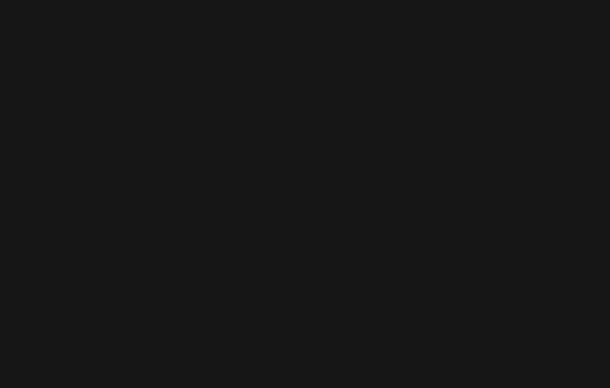
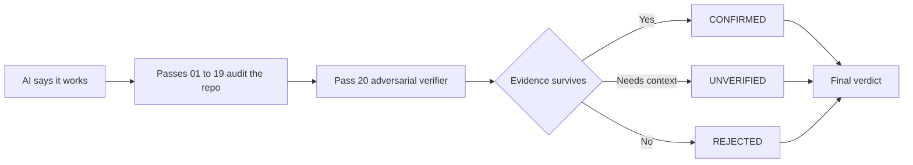
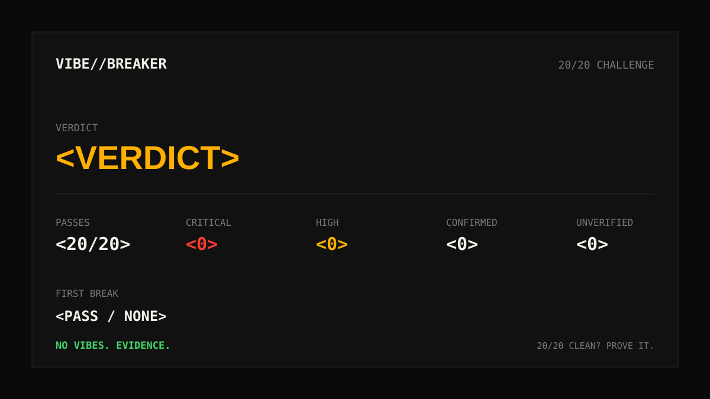

<p align="center">
  
</p>

<p align="center">
  
</p>
<p align="center">
  <strong>インストール不要の CLI：</strong> init → doctor → prompt
</p>

<p align="center">
  <strong>「動く」と「shipできる」の間に、20の adversarial pass。</strong><br/>
  Security · Correctness · Reliability · Scale
</p>

<p align="center">
  <strong>Languages:</strong>
  <a href="README.md">English</a> ·
  <a href="README.tr.md">Türkçe</a> ·
  <a href="README.zh-CN.md">简体中文</a> ·
  <a href="README.pt-BR.md">Português (Brasil)</a> ·
  <a href="README.ja.md">日本語</a> ·
  <a href="README.es.md">Español</a> ·
  <a href="README.ko.md">한국어</a> ·
  <a href="README.de.md">Deutsch</a>
</p>

<p align="center">
  <a href="https://www.npmjs.com/package/vibebreaker"></a>
  <a href="https://www.npmjs.com/package/vibebreaker"></a>
  <a href="https://github.com/digitaldonusum/vibebreaker/stargazers"></a>
  <a href="LICENSE"></a>
  
</p>

<p align="center">
  <strong>AIが「動く」と言った。なら、証明させよう。</strong>
</p>

<p align="center">
  VibeBreaker は、AI / vibe coding で作られたソフトウェア向けの、agent 非依存・evidence-first な監査プロトコルです。<br/>
  リポジトリを20種類の failure angle から攻撃的に検査し、最後に adversarial verifier で false positive を落とします。
</p>

---

## ⚡ 1コマンドで開始

```bash
npx vibebreaker init
```

<p align="center">
  <strong>20 passes. One verifier. No vibes. Evidence.</strong>
</p>

### Quick start

```bash
npx vibebreaker init
npx vibebreaker doctor
npx vibebreaker prompt
```

| Command | 内容 |
|---|---|
| `init` | `.vibebreaker/` workspace を作成し、protocol、20 passes、template、agent prompt を配置 |
| `doctor` | ローカル監査 workspace が完全か確認 |
| `prompt` | coding agent に渡す正確な指示を表示 |

> **Privacy by design:** VibeBreaker はモデルを勝手に選んだり、source code を第三者 API に送信したりしません。フローは agent-agnostic のままです。

---

## 「動く」から「証拠がある」へ

| 01 — Attack | 02 — Verify | 03 — Decide |
|---|---|---|
| 最初の19 pass が security、reliability、data、scale を攻撃的に検査。 | Pass 20 が各 candidate finding を**反証しようとする**。 | evidence に耐えた finding だけが最終 verdict に残る。 |
| Injection、IDOR、race condition、N+1、leak、retry bug などを探す。 | 証拠不足は reject されるか `UNVERIFIED` に残る。 | `BROKEN`、`FIX BEFORE SHIP`、`SURVIVED*`、`20/20 CLEAN`。 |



---

## 20-Pass Protocol

| | | | |
|---|---|---|---|
| **01** Injection | **02** Authentication | **03** Authorization / IDOR | **04** Secrets |
| **05** Failure Paths | **06** Race Conditions | **07** Resource Leaks | **08** N+1 / Data Access |
| **09** Complexity | **10** Memory Growth | **11** Timeouts / Resilience | **12** Idempotency |
| **13** Transactions | **14** Config Hardening | **15** Supply Chain | **16** Observability |
| **17** API Contracts | **18** Cross-Module Risk | **19** Test Gaps | **20** Adversarial Verification |

<details>
<summary><strong>各 pass が何を探すかを見る</strong></summary>

| # | Pass | Failure class |
|---:|---|---|
| 01 | Injection & Untrusted Input | 外部入力から危険な sink への unsafe path |
| 02 | Authentication & Sessions | identity の確立、rotation、recovery、invalidation |
| 03 | Authorization & IDOR | ownership、tenant、role、object-level enforcement の不足 |
| 04 | Secrets & Sensitive Data | credential、PII、debug、response leakage |
| 05 | Failure Paths | partial write、swallowed error、compensation 不足 |
| 06 | Concurrency & Races | check-then-act と非 atomic な state transition |
| 07 | Resource Lifecycle | connection、file、lock、timer、listener leak |
| 08 | Data Access & N+1 | query fan-out、unbounded read、不要な in-memory work |
| 09 | Complexity & Hot Paths | accidental O(n²)、高コスト処理の反復、scale cliff |
| 10 | Memory Growth | unbounded cache、queue、retained graph、dataset |
| 11 | Timeouts & Resilience | external call、retry policy、backoff、failure behavior |
| 12 | Idempotency | duplicate delivery、double effect、retry safety |
| 13 | Consistency Boundaries | transaction、outbox/saga/compensation、state split |
| 14 | Config Hardening | 危険な default と environment drift |
| 15 | Supply Chain | dependency exposure と install-time risk |
| 16 | Observability | diagnostic blind spot と audit trail 不足 |
| 17 | API Contracts | error、pagination、nullability、semantics の不整合 |
| 18 | Cross-Module Contracts | module 間の責任の抜けと emergent failure |
| 19 | Test Gaps | high-impact scenario の欠落と weak assertion |
| 20 | Adversarial Verification | finding の再定位、反証、dedupe、保守的な再評価 |

</details>

---

## Pass 20 が違いを生む

多くの AI audit は「あり得る問題」を大量に出すのは得意です。VibeBreaker は、根拠の弱い主張を最終結果に残しにくくするために設計されています。

Pass 20 はすべての candidate finding を受け取り、次を明示的に要求されます。

- **新しい finding を追加しない**
- 引用された code path を再定位する
- guard、constraint、policy、transaction、framework behavior を探して finding を反証する
- 複数 pass から出た duplicate finding を統合する
- 未確認コードに依存する主張は `UNVERIFIED` に残す
- `CRITICAL` は具体的・reachable・materially damaging な failure に限定する

最終状態は3つだけです。

| Status | 意味 |
|---|---|
| `CONFIRMED` | evidence が adversarial verification を生き残った |
| `UNVERIFIED` | 追加の code、config、runtime context が必要 |
| `REJECTED` | 反証、重複、または証拠不足 |

---

## Final verdict

| Verdict | Rule |
|---|---|
| 🔴 `BROKEN` | confirmed `CRITICAL` が1件以上 |
| 🟠 `FIX BEFORE SHIP` | critical はないが confirmed `HIGH` が1件以上 |
| 🟡 `SURVIVED*` | critical/high はないが低 severity または unresolved finding が残る |
| 🟢 `20/20 CLEAN` | FULL audit、confirmed 0、unverified 0、重大な scope limitation なし |

<p align="center">
  
</p>

> `20/20 CLEAN` は **「永久に安全」** を意味しません。検査した code と利用可能な context の範囲で、protocol を通過した finding がなかったという意味です。

---

## The 20/20 Challenge

あなたの vibe-coded app は本当に ship ready ですか？

20 pass すべてを実行し、Pass 20 に findings を壊させてください。

**20/20 clean? Prove it.**

- result card を共有
- [`20/20 Challenge` issue](.github/ISSUE_TEMPLATE/share-result.yml) を作成
- 結果を共有するときプロジェクトを tag

---

## Audit modes

| Mode | Passes | 用途 |
|---|---|---|
| `FULL` | 01–20 | 初回 launch、major release、本格 review |
| `QUICK` | 01, 02, 03, 04, 11, 12, 13, 19, 20 | 高速な pre-deploy review |
| `DIFF` | Applicable passes + 20 | Pull request と agent-generated change |
| `FOCUS:<area>` | Selected passes + 20 | Auth、data、performance、resilience など |

---

## Evidence contract

すべての candidate finding は、正確な code location、failure path、verification method を示す必要があります。`file:line` がなければ、強い断定はしません。

<details>
<summary><strong>Finding example</strong></summary>

```yaml
id: P03-F02
pass: "03"
title: Cross-tenant project access
status: CANDIDATE
severity: HIGH
confidence: HIGH
location:
  - path: src/api/projects/[id]/route.ts
    line: 47-62
entry_or_trigger: GET /api/projects/:id
evidence: Project is fetched using only a caller-supplied object id.
existing_controls_checked: Authentication exists; no owner or tenant scope was found.
failure_scenario: User A supplies User B's project id and receives B's project.
impact: Cross-tenant data disclosure.
remediation_direction: Scope the lookup to the authenticated principal/tenant.
verification: Request another tenant's project id and assert 403/404.
needs_context: null
```

</details>

---

## 手動で実行する

<details>
<summary><strong>CLIを使わない場合</strong></summary>

VibeBreaker リポジトリを coding agent に渡すか、protocol files をプロジェクトへコピーして次を指示します。

```text
Run the full VibeBreaker 20-Pass Protocol defined in AUDIT_PROTOCOL.md.
Stay read-only. Execute passes 01 through 20 in order.
Write raw pass results under .vibebreaker/raw/ and the final report to .vibebreaker/FINAL_REPORT.md.
Do not fix anything until the final report is complete.
Pass 20 is the adversarial verifier and is the only pass allowed to finalize finding status.
```

リポジトリを読めて Markdown instruction に従える coding agent なら利用できます。

</details>

---

## 推奨 workflow

```text
BUILD
  ↓
VIBEBREAKER AUDIT     ← read-only
  ↓
PASS 20 VERIFICATION
  ↓
FINAL REPORT
  ↓
FIX PLAN
  ↓
FIX
  ↓
RE-RUN RELEVANT PASSES
```

**Review first. Repair second.** Evidence を集め終わる前に auditing agent が勝手に code を直さないようにします。

---

## VibeBreaker が置き換えないもの

VibeBreaker は **SAST/SCA/DAST、professional pentest、load testing、production monitoring の代替ではありません**。coding agent 向けの disciplined white-box review protocol です。

所有している、または監査権限のある software のみに使用してください。

---

<details>
<summary><strong>Repository map</strong></summary>

```text
vibebreaker/
├── bin/                     # CLI entrypoint
├── src/                     # CLI implementation
├── test/                    # Node tests
├── README.md
├── README.tr.md
├── AGENTS.md
├── AUDIT_PROTOCOL.md
├── PROMPT_PACK.md
├── BRAND.md
├── CHALLENGE.md
├── prompts/                 # 20 focused passes
├── templates/               # finding + final report contracts
├── assets/                  # hero, badge, result-card assets
└── .github/ISSUE_TEMPLATE/  # community result sharing
```

</details>

## Contributing

最も価値のある contribution は、実際の production bug を生み、false positive を増やしすぎず、evidence-backed audit rule として表現できる failure class です。詳しくは [`CONTRIBUTING.md`](CONTRIBUTING.md)。

## License

MIT

---

<p align="center">
  <strong>AIが「動く」と言った。なら、証明させよう。</strong><br/>
  <sub>VibeBreaker があなたの AI の見落とした最初の本物の問題を見つけたら、Star を検討してください。</sub>
</p>
