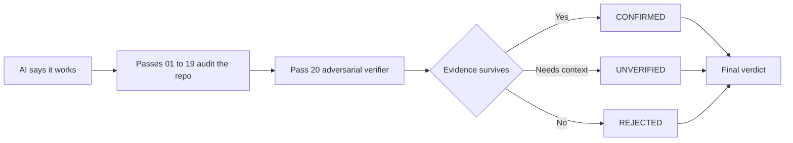

<p align="center">
  
</p>

<p align="center">
  
</p>
<p align="center">
  <strong>설치 없는 CLI:</strong> init → doctor → prompt
</p>

<p align="center">
  <strong>“작동한다”와 “ship해도 된다” 사이의 20개 adversarial pass.</strong><br/>
  Security · Correctness · Reliability · Scale
</p>

<p align="center">
  <strong>Languages:</strong>
  <a href="README.md">English</a> ·
  <a href="README.tr.md">Türkçe</a> ·
  <a href="README.zh-CN.md">简体中文</a> ·
  <a href="README.pt-BR.md">Português (Brasil)</a> ·
  <a href="README.ja.md">日本語</a> ·
  <a href="README.es.md">Español</a> ·
  <a href="README.ko.md">한국어</a> ·
  <a href="README.de.md">Deutsch</a>
</p>

<p align="center">
  <a href="https://www.npmjs.com/package/vibebreaker"></a>
  <a href="https://www.npmjs.com/package/vibebreaker"></a>
  <a href="https://github.com/digitaldonusum/vibebreaker/stargazers"></a>
  <a href="LICENSE"></a>
  
</p>

<p align="center">
  <strong>AI가 “작동한다”고 했습니다. 증명하게 하세요.</strong>
</p>

<p align="center">
  VibeBreaker는 AI / vibe coding으로 만든 소프트웨어를 위한 agent-agnostic, evidence-first 감사 프로토콜입니다.<br/>
  저장소를 20가지 failure angle에서 공격적으로 검사한 뒤, 마지막 adversarial verifier가 false positive를 걸러냅니다.
</p>

---

## ⚡ 한 줄로 시작

```bash
npx vibebreaker init
```

<p align="center">
  <strong>20 passes. One verifier. No vibes. Evidence.</strong>
</p>

### Quick start

```bash
npx vibebreaker init
npx vibebreaker doctor
npx vibebreaker prompt
```

| Command | 역할 |
|---|---|
| `init` | `.vibebreaker/` workspace를 만들고 protocol, 20 passes, template, agent prompt를 배치합니다 |
| `doctor` | 로컬 audit workspace가 완전한지 확인합니다 |
| `prompt` | coding agent에 전달할 정확한 지시문을 출력합니다 |

> **Privacy by design:** VibeBreaker는 몰래 모델을 선택하거나 source code를 제3자 API로 전송하지 않습니다. 워크플로는 agent-agnostic으로 유지됩니다.

---

## “작동한다”에서 “증거가 있다”로

| 01 — Attack | 02 — Verify | 03 — Decide |
|---|---|---|
| 처음 19개 pass가 security, reliability, data, scale 관점에서 저장소를 공격적으로 검사합니다. | Pass 20은 각 candidate finding을 **반증하려고 시도합니다**. | evidence를 버틴 finding만 최종 verdict에 남습니다. |
| Injection, IDOR, race condition, N+1, leak, retry bug 등을 찾습니다. | 증거가 부족하면 reject되거나 `UNVERIFIED`로 남습니다. | `BROKEN`, `FIX BEFORE SHIP`, `SURVIVED*`, `20/20 CLEAN`. |



---

## 20-Pass Protocol

| | | | |
|---|---|---|---|
| **01** Injection | **02** Authentication | **03** Authorization / IDOR | **04** Secrets |
| **05** Failure Paths | **06** Race Conditions | **07** Resource Leaks | **08** N+1 / Data Access |
| **09** Complexity | **10** Memory Growth | **11** Timeouts / Resilience | **12** Idempotency |
| **13** Transactions | **14** Config Hardening | **15** Supply Chain | **16** Observability |
| **17** API Contracts | **18** Cross-Module Risk | **19** Test Gaps | **20** Adversarial Verification |

<details>
<summary><strong>각 pass가 무엇을 찾는지 보기</strong></summary>

| # | Pass | Failure class |
|---:|---|---|
| 01 | Injection & Untrusted Input | 외부 input에서 위험한 sink로 이어지는 unsafe path |
| 02 | Authentication & Sessions | identity 생성, rotation, recovery, invalidation 문제 |
| 03 | Authorization & IDOR | ownership, tenant, role, object-level enforcement 누락 |
| 04 | Secrets & Sensitive Data | credential, PII, debug, response leakage |
| 05 | Failure Paths | partial write, swallowed error, compensation 누락 |
| 06 | Concurrency & Races | check-then-act와 비원자적 state transition |
| 07 | Resource Lifecycle | connection, file, lock, timer, listener leak |
| 08 | Data Access & N+1 | query fan-out, unbounded read, 불필요한 in-memory work |
| 09 | Complexity & Hot Paths | accidental O(n²), 반복되는 비싼 작업, scale cliff |
| 10 | Memory Growth | unbounded cache, queue, retained graph, dataset |
| 11 | Timeouts & Resilience | external call, retry policy, backoff, failure behavior |
| 12 | Idempotency | duplicate delivery, double effect, retry safety |
| 13 | Consistency Boundaries | transaction, outbox/saga/compensation, state inconsistency |
| 14 | Config Hardening | 위험한 default와 environment drift |
| 15 | Supply Chain | dependency exposure와 install-time risk |
| 16 | Observability | diagnostic blind spot과 audit trail 누락 |
| 17 | API Contracts | error, pagination, nullability, semantics 불일치 |
| 18 | Cross-Module Contracts | 모듈 간 책임 공백과 emergent failure |
| 19 | Test Gaps | high-impact scenario 누락과 weak assertion |
| 20 | Adversarial Verification | finding 재확인, 반증, dedupe, 보수적 재평가 |

</details>

---

## Pass 20이 핵심 차이입니다

대부분의 AI audit은 *가능한 문제*를 많이 만들어내는 데 능숙합니다. VibeBreaker는 근거가 약한 주장이 최종 결과까지 살아남기 어렵게 설계되었습니다.

Pass 20은 모든 candidate finding을 받아 다음을 명시적으로 수행합니다.

- **새 finding을 추가하지 않음**
- 인용된 code path를 다시 찾음
- guard, constraint, policy, transaction, framework behavior를 찾아 finding을 반증함
- 여러 pass에서 나온 duplicate finding을 병합함
- 보지 못한 코드에 의존하는 주장은 `UNVERIFIED`로 유지함
- `CRITICAL`은 구체적이고 reachable하며 실제 피해가 큰 failure에만 유지함

최종 상태는 세 가지뿐입니다.

| Status | 의미 |
|---|---|
| `CONFIRMED` | evidence가 adversarial verification을 통과함 |
| `UNVERIFIED` | 추가 code, config, runtime context가 필요함 |
| `REJECTED` | 반증되었거나 중복이거나 evidence가 부족함 |

---

## Final verdict

| Verdict | Rule |
|---|---|
| 🔴 `BROKEN` | confirmed `CRITICAL`이 1개 이상 |
| 🟠 `FIX BEFORE SHIP` | critical은 없지만 confirmed `HIGH`가 1개 이상 |
| 🟡 `SURVIVED*` | critical/high는 없지만 낮은 severity 또는 unresolved finding이 남음 |
| 🟢 `20/20 CLEAN` | FULL audit, confirmed 0, unverified 0, 중대한 scope limitation 없음 |

<p align="center">
  
</p>

> `20/20 CLEAN`은 **“영원히 안전하다”는 뜻이 아닙니다.** 검사한 코드와 제공된 context 안에서 protocol을 통과한 finding이 없었다는 뜻입니다.

---

## The 20/20 Challenge

당신의 vibe-coded app이 정말 ship ready라고 생각하시나요?

20개 pass를 모두 실행하고 Pass 20이 findings를 무너뜨리게 해보세요.

**20/20 clean? Prove it.**

- result card 공유
- [`20/20 Challenge` issue](.github/ISSUE_TEMPLATE/share-result.yml) 열기
- 결과를 공유할 때 프로젝트 태그하기

---

## Audit modes

| Mode | Passes | 적합한 상황 |
|---|---|---|
| `FULL` | 01–20 | 첫 launch, major release, 본격적인 review |
| `QUICK` | 01, 02, 03, 04, 11, 12, 13, 19, 20 | 빠른 pre-deploy review |
| `DIFF` | Applicable passes + 20 | Pull request와 agent-generated change |
| `FOCUS:<area>` | Selected passes + 20 | Auth, data, performance, resilience 등 |

---

## Evidence contract

모든 candidate finding은 정확한 code location, failure path, verification method를 제시해야 합니다. `file:line`이 없다면 강한 확신을 주지 않습니다.

<details>
<summary><strong>Finding example</strong></summary>

```yaml
id: P03-F02
pass: "03"
title: Cross-tenant project access
status: CANDIDATE
severity: HIGH
confidence: HIGH
location:
  - path: src/api/projects/[id]/route.ts
    line: 47-62
entry_or_trigger: GET /api/projects/:id
evidence: Project is fetched using only a caller-supplied object id.
existing_controls_checked: Authentication exists; no owner or tenant scope was found.
failure_scenario: User A supplies User B's project id and receives B's project.
impact: Cross-tenant data disclosure.
remediation_direction: Scope the lookup to the authenticated principal/tenant.
verification: Request another tenant's project id and assert 403/404.
needs_context: null
```

</details>

---

## 수동 실행

<details>
<summary><strong>CLI를 사용하지 않으려면</strong></summary>

VibeBreaker 저장소를 coding agent에 전달하거나 protocol files를 프로젝트로 복사한 뒤 다음을 지시하세요.

```text
Run the full VibeBreaker 20-Pass Protocol defined in AUDIT_PROTOCOL.md.
Stay read-only. Execute passes 01 through 20 in order.
Write raw pass results under .vibebreaker/raw/ and the final report to .vibebreaker/FINAL_REPORT.md.
Do not fix anything until the final report is complete.
Pass 20 is the adversarial verifier and is the only pass allowed to finalize finding status.
```

저장소를 읽고 Markdown instruction을 따를 수 있는 coding agent라면 사용할 수 있습니다.

</details>

---

## 권장 workflow

```text
BUILD
  ↓
VIBEBREAKER AUDIT     ← read-only
  ↓
PASS 20 VERIFICATION
  ↓
FINAL REPORT
  ↓
FIX PLAN
  ↓
FIX
  ↓
RE-RUN RELEVANT PASSES
```

**Review first. Repair second.** Evidence 수집이 끝나기 전에 auditing agent가 몰래 코드를 수정하지 않게 하세요.

---

## VibeBreaker가 아닌 것

VibeBreaker는 **SAST/SCA/DAST, professional pentest, load testing, production monitoring을 대체하지 않습니다.** coding agent를 위한 disciplined white-box review protocol입니다.

본인이 소유했거나 감사 권한이 있는 software에만 사용하세요.

---

<details>
<summary><strong>Repository map</strong></summary>

```text
vibebreaker/
├── bin/                     # CLI entrypoint
├── src/                     # CLI implementation
├── test/                    # Node tests
├── README.md
├── README.tr.md
├── AGENTS.md
├── AUDIT_PROTOCOL.md
├── PROMPT_PACK.md
├── BRAND.md
├── CHALLENGE.md
├── prompts/                 # 20 focused passes
├── templates/               # finding + final report contracts
├── assets/                  # hero, badge, result-card assets
└── .github/ISSUE_TEMPLATE/  # community result sharing
```

</details>

## Contributing

가장 가치 있는 contribution은 실제 production bug를 만들 수 있고, false positive를 과도하게 늘리지 않으면서 evidence-backed audit rule로 표현 가능한 failure class입니다. [`CONTRIBUTING.md`](CONTRIBUTING.md)를 참고하세요.

## License

MIT

---

<p align="center">
  <strong>AI가 “작동한다”고 했습니다. 증명하게 하세요.</strong><br/>
  <sub>VibeBreaker가 당신의 AI가 놓친 첫 실제 문제를 찾았다면, 저장소에 Star를 고려해 주세요.</sub>
</p>
