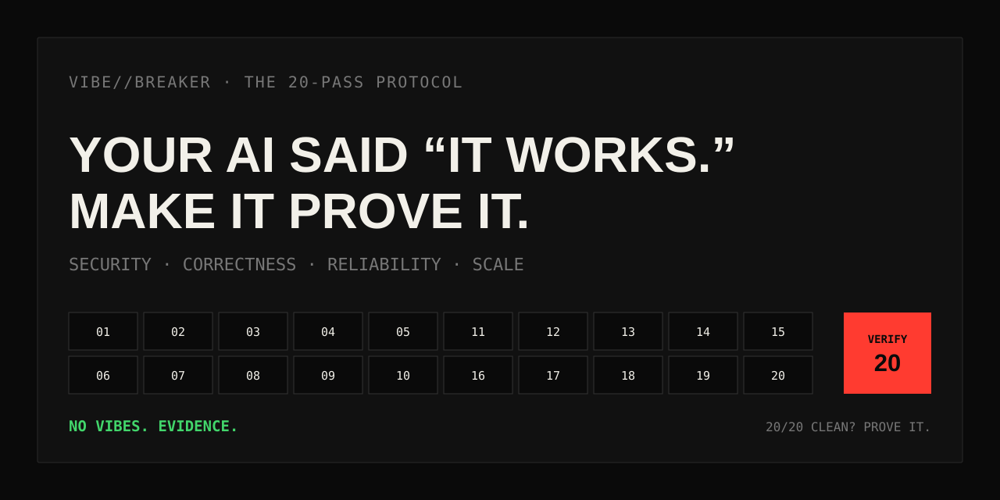

<p align="center">
  
</p>

<p align="center">
  <a href="README.md">English</a> ·
  <a href="README.tr.md">Türkçe</a>
</p>

<p align="center">
  <a href="https://www.npmjs.com/package/vibebreaker"></a>
  <a href="https://www.npmjs.com/package/vibebreaker"></a>
  <a href="https://github.com/digitaldonusum/vibebreaker/stargazers"></a>
  <a href="LICENSE"></a>
  
</p>

# VibeBreaker

**Your AI said “it works.” Make it prove it.**

VibeBreaker is an agent-agnostic, evidence-first audit protocol for AI/vibe-coded software. It attacks a repository from 20 different failure angles — injection, IDOR, race conditions, N+1 queries, idempotency, transaction boundaries, memory growth, failure paths, API contracts, test gaps, and more — then uses a final adversarial verifier to reject false positives.

<p align="center">
  <strong>20 passes. One verifier. No vibes. Evidence.</strong>
</p>

## Install in seconds

```bash
npx vibebreaker init
```

## Quick start

```bash
npx vibebreaker init
npx vibebreaker doctor
npx vibebreaker prompt
```

- `init` creates a local `.vibebreaker/` workspace containing the protocol, all 20 passes, templates, configuration, and a ready-to-copy agent prompt.
- `doctor` verifies that the workspace is complete.
- `prompt` prints the exact instruction to give your coding agent.

The audit remains agent-agnostic: VibeBreaker does not silently choose a model or send your source code to a third-party API.

> VibeBreaker is not a replacement for SAST/SCA/DAST, a professional pentest, load testing, or production monitoring. It is a disciplined white-box review protocol for coding agents.

## The 20/20 Challenge

Think your vibe-coded app is ready to ship?

Run all 20 passes. Pass 20 tries to disprove the other 19. If you finish with no confirmed findings, no unresolved findings, and no material scope gaps, you earned a **20/20 CLEAN** result.

**20/20 clean? Prove it.**

Share the result card or open a [`20/20 Challenge` issue](.github/ISSUE_TEMPLATE/share-result.yml).

## Run it manually

If you do not want to use the CLI, give your coding agent the VibeBreaker repository or copy the protocol files into the project, then instruct it:

```text
Run the full VibeBreaker 20-Pass Protocol defined in AUDIT_PROTOCOL.md.
Stay read-only. Execute passes 01 through 20 in order.
Write raw pass results under .vibebreaker/raw/ and the final report to .vibebreaker/FINAL_REPORT.md.
Do not fix anything until the final report is complete.
Pass 20 is the adversarial verifier and is the only pass allowed to finalize finding status.
```

Works with any coding agent that can inspect a repository and follow Markdown instructions. No vendor-specific agent behavior is assumed.

## What it hunts

| # | Pass | Failure class |
|---:|---|---|
| 01 | Injection & Untrusted Input | Unsafe paths from external input to dangerous sinks |
| 02 | Authentication & Sessions | Identity establishment, rotation, recovery, invalidation |
| 03 | Authorization & IDOR | Missing ownership, tenant, role, object-level enforcement |
| 04 | Secrets & Sensitive Data | Credential, PII, debug and response leakage |
| 05 | Failure Paths | Partial writes, swallowed errors, missing compensation |
| 06 | Concurrency & Races | Check-then-act and non-atomic state transitions |
| 07 | Resource Lifecycle | Connections, files, locks, timers, listeners and leaks |
| 08 | Data Access & N+1 | Query fan-out, unbounded reads, avoidable in-memory work |
| 09 | Complexity & Hot Paths | Accidental O(n²), repeated expensive work, scale cliffs |
| 10 | Memory Growth | Unbounded caches, queues, retained graphs and datasets |
| 11 | Timeouts & Resilience | External calls, retry policy, backoff, failure behavior |
| 12 | Idempotency | Duplicate delivery, double effects, retry safety |
| 13 | Consistency Boundaries | Transactions, outbox/saga/compensation, split-brain state |
| 14 | Config Hardening | Dangerous defaults and environment drift |
| 15 | Supply Chain | Dependency exposure and install-time risk |
| 16 | Observability | Diagnostic blind spots and missing audit trails |
| 17 | API Contracts | Inconsistent errors, pagination, nullability and semantics |
| 18 | Cross-Module Contracts | Responsibility gaps and emergent interaction failures |
| 19 | Test Gaps | Missing high-damage scenarios and weak assertions |
| 20 | Adversarial Verification | Relocate, disprove, dedupe and conservatively re-score |

## Why Pass 20 matters

Most AI audits are good at producing *possible* problems. VibeBreaker is designed to make unsupported claims expensive.

Pass 20 receives every candidate finding and is explicitly told:

- **Do not add new findings.**
- Relocate the cited evidence; if it does not exist, reject it.
- Try to disprove the issue using existing guards, types, constraints, policies, or verified framework behavior.
- Merge duplicates from different passes.
- Keep unseen-code dependencies `UNVERIFIED`.
- Use `CRITICAL` only when a concrete catastrophic failure can be stated.

The final output has only three finding states: `CONFIRMED`, `UNVERIFIED`, and `REJECTED`.

## Verdicts

| Verdict | Rule |
|---|---|
| `BROKEN` | At least one confirmed `CRITICAL` |
| `FIX BEFORE SHIP` | No criticals, but at least one confirmed `HIGH` |
| `SURVIVED*` | No critical/high; confirmed lower-severity or unresolved findings remain |
| `20/20 CLEAN` | FULL audit, zero confirmed, zero unverified, no material scope limitation |

A clean VibeBreaker result never means “secure forever.” It means no finding survived the protocol within the inspected code and available context.

## Evidence contract

Every candidate finding must include:

```yaml
id: P03-F02
pass: "03"
title: Cross-tenant project access
status: CANDIDATE
severity: HIGH
confidence: HIGH
location:
  - path: src/api/projects/[id]/route.ts
    line: 47-62
entry_or_trigger: GET /api/projects/:id
evidence: Project is fetched using only a caller-supplied object id.
existing_controls_checked: Authentication exists; no owner or tenant scope was found.
failure_scenario: User A supplies User B's project id and receives B's project.
impact: Cross-tenant data disclosure.
remediation_direction: Scope the lookup to the authenticated principal/tenant.
verification: Request another tenant's project id and assert 403/404.
needs_context: null
```

No `file:line`, no confident claim. Missing context stays missing context.

## Audit modes

| Mode | Passes | Best for |
|---|---|---|
| `FULL` | 01–20 | First launch, major release, serious review |
| `QUICK` | 01, 02, 03, 04, 11, 12, 13, 19, 20 | Fast pre-deploy review |
| `DIFF` | Applicable passes + 20 | Pull requests and agent-generated changes |
| `FOCUS:<area>` | Selected passes + 20 | Auth, data, performance, resilience, etc. |

## Recommended workflow

```text
BUILD
  ↓
VIBEBREAKER AUDIT     ← read-only
  ↓
PASS 20 VERIFICATION
  ↓
FINAL REPORT
  ↓
FIX PLAN
  ↓
FIX
  ↓
RE-RUN RELEVANT PASSES
```

Do not let the auditing agent silently patch code while it is still gathering evidence. Review first; repair second.

## Repository map

```text
vibebreaker/
├── bin/                     # CLI entrypoint
├── src/                     # CLI implementation
├── test/                    # Node tests
├── README.md
├── README.tr.md
├── AGENTS.md
├── AUDIT_PROTOCOL.md
├── PROMPT_PACK.md
├── BRAND.md
├── CHALLENGE.md
├── prompts/                 # 20 focused passes
├── templates/               # finding + final report contracts
├── assets/                  # hero, badge, result-card assets
└── .github/ISSUE_TEMPLATE/  # community result sharing
```

## Use responsibly

Only audit software you own or are authorized to review. VibeBreaker is intended for defensive code review and pre-release validation.

## Contributing

The best contribution is a failure class that produces a real production bug and can be expressed as an evidence-backed audit rule without inflating false positives. See [`CONTRIBUTING.md`](CONTRIBUTING.md).

## License

MIT
