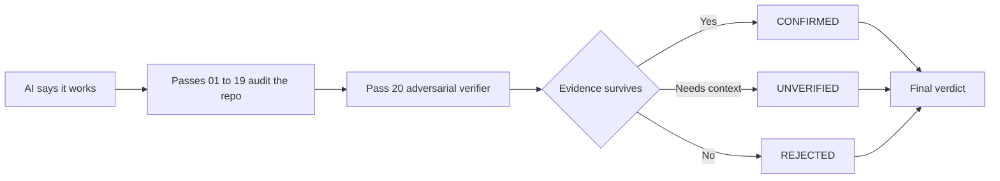

<p align="center">
  
</p>

<p align="center">
  
</p>
<p align="center">
  <strong>CLI sem instalação:</strong> init → doctor → prompt
</p>

<p align="center">
  <strong>20 passes adversariais entre “funciona” e “pode ir para produção”.</strong><br/>
  Segurança · Correção · Confiabilidade · Escala
</p>

<p align="center">
  <strong>Languages:</strong>
  <a href="README.md">English</a> ·
  <a href="README.tr.md">Türkçe</a> ·
  <a href="README.zh-CN.md">简体中文</a> ·
  <a href="README.pt-BR.md">Português (Brasil)</a> ·
  <a href="README.ja.md">日本語</a> ·
  <a href="README.es.md">Español</a> ·
  <a href="README.ko.md">한국어</a> ·
  <a href="README.de.md">Deutsch</a>
</p>

<p align="center">
  <a href="https://www.npmjs.com/package/vibebreaker"></a>
  <a href="https://www.npmjs.com/package/vibebreaker"></a>
  <a href="https://github.com/digitaldonusum/vibebreaker/stargazers"></a>
  <a href="LICENSE"></a>
  
</p>

<p align="center">
  <strong>Sua IA disse “funciona”. Faça ela provar.</strong>
</p>

<p align="center">
  VibeBreaker é um protocolo de auditoria agnóstico a agent e orientado por evidências para software criado com IA / vibe coding.<br/>
  Ele ataca o repositório por 20 classes de falha diferentes e usa um verificador adversarial final para eliminar false positives.
</p>

---

## ⚡ Comece com um comando

```bash
npx vibebreaker init
```

<p align="center">
  <strong>20 passes. Um verifier. Sem vibes. Evidência.</strong>
</p>

### Quick start

```bash
npx vibebreaker init
npx vibebreaker doctor
npx vibebreaker prompt
```

| Comando | O que faz |
|---|---|
| `init` | Cria um workspace `.vibebreaker/` local com o protocolo, os 20 passes, templates e o prompt para o agent |
| `doctor` | Verifica se o workspace de auditoria está completo |
| `prompt` | Imprime a instrução exata para entregar ao seu coding agent |

> **Privado por design:** o VibeBreaker não escolhe silenciosamente um modelo nem envia seu código-fonte para uma API de terceiros. O fluxo permanece agent-agnostic.

---

## De “funciona” para evidência

| 01 — Attack | 02 — Verify | 03 — Decide |
|---|---|---|
| Rode 19 passes focados em segurança, confiabilidade, dados e escala. | O Pass 20 tenta **refutar** cada finding candidato. | Só findings sustentados por evidência chegam ao verdict final. |
| Procure injection, IDOR, race conditions, N+1, leaks, retry bugs e mais. | Evidência insuficiente é rejeitada ou fica como `UNVERIFIED`. | `BROKEN`, `FIX BEFORE SHIP`, `SURVIVED*` ou `20/20 CLEAN`. |



---

## O 20-Pass Protocol

| | | | |
|---|---|---|---|
| **01** Injection | **02** Authentication | **03** Authorization / IDOR | **04** Secrets |
| **05** Failure Paths | **06** Race Conditions | **07** Resource Leaks | **08** N+1 / Data Access |
| **09** Complexity | **10** Memory Growth | **11** Timeouts / Resilience | **12** Idempotency |
| **13** Transactions | **14** Config Hardening | **15** Supply Chain | **16** Observability |
| **17** API Contracts | **18** Cross-Module Risk | **19** Test Gaps | **20** Adversarial Verification |

<details>
<summary><strong>Veja o que cada pass procura</strong></summary>

| # | Pass | Classe de falha |
|---:|---|---|
| 01 | Injection & Untrusted Input | Caminhos inseguros de input externo até sinks perigosos |
| 02 | Authentication & Sessions | Estabelecimento, rotação, recuperação e invalidação de identidade |
| 03 | Authorization & IDOR | Falta de ownership, tenant, role ou enforcement por objeto |
| 04 | Secrets & Sensitive Data | Vazamento de credenciais, PII, debug e respostas |
| 05 | Failure Paths | Escritas parciais, erros engolidos e compensação ausente |
| 06 | Concurrency & Races | Check-then-act e transições de estado não atômicas |
| 07 | Resource Lifecycle | Leaks de conexões, arquivos, locks, timers e listeners |
| 08 | Data Access & N+1 | Query fan-out, leituras sem limite e trabalho desnecessário em memória |
| 09 | Complexity & Hot Paths | O(n²) acidental, trabalho caro repetido e cliffs de escala |
| 10 | Memory Growth | Caches, filas, grafos e datasets sem limite |
| 11 | Timeouts & Resilience | Chamadas externas, retry policy, backoff e comportamento de falha |
| 12 | Idempotency | Entrega duplicada, efeitos duplicados e segurança em retries |
| 13 | Consistency Boundaries | Transactions, outbox/saga/compensation e estado inconsistente |
| 14 | Config Hardening | Defaults perigosos e drift de ambiente |
| 15 | Supply Chain | Exposição de dependências e risco em install-time |
| 16 | Observability | Pontos cegos de diagnóstico e ausência de audit trail |
| 17 | API Contracts | Erros, paginação, nullability e semântica inconsistentes |
| 18 | Cross-Module Contracts | Lacunas de responsabilidade e falhas emergentes entre módulos |
| 19 | Test Gaps | Cenários críticos ausentes e assertions fracas |
| 20 | Adversarial Verification | Relocalizar, refutar, deduplicar e reclassificar conservadoramente |

</details>

---

## O Pass 20 é o diferencial

A maioria das auditorias com IA é boa em produzir problemas *possíveis*. O VibeBreaker foi desenhado para tornar caro manter uma alegação sem evidência.

O Pass 20 recebe todos os findings candidatos e deve explicitamente:

- **não adicionar novos findings**
- relocalizar cada trecho de código citado
- procurar guards, constraints, policies, transactions e comportamento de framework que refutem o problema
- unir findings duplicados vindos de passes diferentes
- manter dependências de código não inspecionado como `UNVERIFIED`
- reservar `CRITICAL` para falhas concretas, alcançáveis e materialmente graves

O resultado final usa apenas três estados:

| Status | Significado |
|---|---|
| `CONFIRMED` | A evidência sobreviveu à verificação adversarial |
| `UNVERIFIED` | É necessário mais código, config ou contexto de runtime |
| `REJECTED` | O finding foi refutado, duplicado ou não tinha suporte suficiente |

---

## Verdict final

| Verdict | Regra |
|---|---|
| 🔴 `BROKEN` | Pelo menos um `CRITICAL` confirmado |
| 🟠 `FIX BEFORE SHIP` | Nenhum critical, mas pelo menos um `HIGH` confirmado |
| 🟡 `SURVIVED*` | Nenhum critical/high; ainda existem findings menores ou não resolvidos |
| 🟢 `20/20 CLEAN` | Audit `FULL`, zero confirmed, zero unverified e sem limitação material de escopo |

<p align="center">
  
</p>

> `20/20 CLEAN` **não significa “seguro para sempre”**. Significa apenas que nenhum finding sobreviveu ao protocolo dentro do código e do contexto inspecionados.

---

## The 20/20 Challenge

Acha que seu app vibe-coded está pronto para produção?

Rode os 20 passes e deixe o Pass 20 tentar desmontar os findings.

**20/20 clean? Prove.**

- Compartilhe seu result card
- Abra uma issue [`20/20 Challenge`](.github/ISSUE_TEMPLATE/share-result.yml)
- Marque o projeto quando publicar o resultado

---

## Modos de auditoria

| Modo | Passes | Melhor para |
|---|---|---|
| `FULL` | 01–20 | Primeiro launch, release importante, revisão séria |
| `QUICK` | 01, 02, 03, 04, 11, 12, 13, 19, 20 | Revisão rápida antes do deploy |
| `DIFF` | Passes aplicáveis + 20 | Pull requests e mudanças geradas por agents |
| `FOCUS:<area>` | Passes selecionados + 20 | Auth, data, performance, resilience etc. |

---

## Contrato de evidência

Todo finding candidato precisa apontar a localização exata no código, o caminho de falha e o método de verificação. Sem `file:line`, sem afirmação confiante.

<details>
<summary><strong>Exemplo de finding</strong></summary>

```yaml
id: P03-F02
pass: "03"
title: Cross-tenant project access
status: CANDIDATE
severity: HIGH
confidence: HIGH
location:
  - path: src/api/projects/[id]/route.ts
    line: 47-62
entry_or_trigger: GET /api/projects/:id
evidence: Project is fetched using only a caller-supplied object id.
existing_controls_checked: Authentication exists; no owner or tenant scope was found.
failure_scenario: User A supplies User B's project id and receives B's project.
impact: Cross-tenant data disclosure.
remediation_direction: Scope the lookup to the authenticated principal/tenant.
verification: Request another tenant's project id and assert 403/404.
needs_context: null
```

</details>

---

## Rodar manualmente

<details>
<summary><strong>Não quer usar a CLI?</strong></summary>

Entregue o repositório do VibeBreaker ao seu coding agent ou copie os arquivos do protocolo para o projeto e instrua:

```text
Run the full VibeBreaker 20-Pass Protocol defined in AUDIT_PROTOCOL.md.
Stay read-only. Execute passes 01 through 20 in order.
Write raw pass results under .vibebreaker/raw/ and the final report to .vibebreaker/FINAL_REPORT.md.
Do not fix anything until the final report is complete.
Pass 20 is the adversarial verifier and is the only pass allowed to finalize finding status.
```

Funciona com qualquer coding agent capaz de inspecionar um repositório e seguir instruções em Markdown.

</details>

---

## Workflow recomendado

```text
BUILD
  ↓
VIBEBREAKER AUDIT     ← read-only
  ↓
PASS 20 VERIFICATION
  ↓
FINAL REPORT
  ↓
FIX PLAN
  ↓
FIX
  ↓
RE-RUN RELEVANT PASSES
```

**Revise primeiro. Corrija depois.** Não deixe o agent de auditoria alterar código silenciosamente enquanto ainda está coletando evidências.

---

## O que o VibeBreaker não é

VibeBreaker **não substitui** SAST/SCA/DAST, pentest profissional, load testing ou production monitoring. Ele é um protocolo disciplinado de white-box review para coding agents.

Audite somente software que você possui ou está autorizado a revisar.

---

<details>
<summary><strong>Mapa do repositório</strong></summary>

```text
vibebreaker/
├── bin/                     # CLI entrypoint
├── src/                     # CLI implementation
├── test/                    # Node tests
├── README.md
├── README.tr.md
├── AGENTS.md
├── AUDIT_PROTOCOL.md
├── PROMPT_PACK.md
├── BRAND.md
├── CHALLENGE.md
├── prompts/                 # 20 focused passes
├── templates/               # finding + final report contracts
├── assets/                  # hero, badge, result-card assets
└── .github/ISSUE_TEMPLATE/  # community result sharing
```

</details>

## Contribuindo

A melhor contribuição é uma classe de falha que gere um bug real de produção e possa ser expressa como uma regra de auditoria baseada em evidências sem inflar false positives. Veja [`CONTRIBUTING.md`](CONTRIBUTING.md).

## Licença

MIT

---

<p align="center">
  <strong>Sua IA disse “funciona”. Faça ela provar.</strong><br/>
  <sub>Se o VibeBreaker encontrar a primeira coisa real que sua IA deixou passar, considere dar uma Star no repositório.</sub>
</p>
