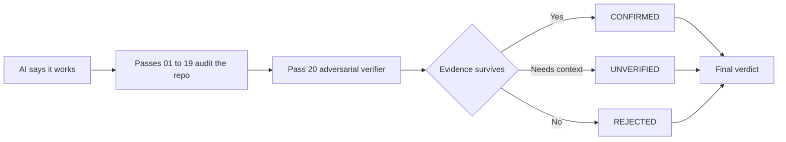

<p align="center">
  
</p>

<p align="center">
  
</p>
<p align="center">
  <strong>零安装 CLI：</strong> init → doctor → prompt
</p>

<p align="center">
  <strong>在“能运行”和“可以上线”之间，加入 20 轮对抗式审计。</strong><br/>
  安全 · 正确性 · 可靠性 · 扩展性
</p>

<p align="center">
  <strong>Languages:</strong>
  <a href="README.md">English</a> ·
  <a href="README.tr.md">Türkçe</a> ·
  <a href="README.zh-CN.md">简体中文</a> ·
  <a href="README.pt-BR.md">Português (Brasil)</a> ·
  <a href="README.ja.md">日本語</a> ·
  <a href="README.es.md">Español</a> ·
  <a href="README.ko.md">한국어</a> ·
  <a href="README.de.md">Deutsch</a>
</p>

<p align="center">
  <a href="https://www.npmjs.com/package/vibebreaker"></a>
  <a href="https://www.npmjs.com/package/vibebreaker"></a>
  <a href="https://github.com/digitaldonusum/vibebreaker/stargazers"></a>
  <a href="LICENSE"></a>
  
</p>

<p align="center">
  <strong>AI 说“能运行”。让它拿出证据。</strong>
</p>

<p align="center">
  VibeBreaker 是一个与 agent 无关、以证据为核心的审计协议，专为 AI / vibe-coded 软件设计。<br/>
  它从 20 类失败路径对代码仓库进行攻击式检查，并在最后通过对抗验证器主动淘汰 false positive。
</p>

---

## ⚡ 一条命令开始

```bash
npx vibebreaker init
```

<p align="center">
  <strong>20 个 pass。1 个 verifier。不靠感觉，只看证据。</strong>
</p>

### 快速开始

```bash
npx vibebreaker init
npx vibebreaker doctor
npx vibebreaker prompt
```

| 命令 | 作用 |
|---|---|
| `init` | 在当前项目创建 `.vibebreaker/` 工作区，包含协议、20 个 pass、模板和 agent prompt |
| `doctor` | 检查本地审计工作区是否完整 |
| `prompt` | 输出可直接交给 coding agent 的审计指令 |

> **隐私优先：** VibeBreaker 不会静默选择模型，也不会自动把源码发送到第三方 API。审计流程保持 agent-agnostic。

---

## 从“能运行”到“有证据”

| 01 — Attack | 02 — Verify | 03 — Decide |
|---|---|---|
| 前 19 个 pass 从安全、可靠性、数据和扩展性等角度攻击代码库。 | Pass 20 会尝试**推翻**每一条候选 finding。 | 只有经得起验证的 finding 才进入最终 verdict。 |
| 检查 injection、IDOR、race condition、N+1、leak、retry bug 等。 | 缺少证据的 finding 会被拒绝或保留为 `UNVERIFIED`。 | 最终结果为 `BROKEN`、`FIX BEFORE SHIP`、`SURVIVED*` 或 `20/20 CLEAN`。 |



---

## 20-Pass Protocol

| | | | |
|---|---|---|---|
| **01** Injection | **02** Authentication | **03** Authorization / IDOR | **04** Secrets |
| **05** Failure Paths | **06** Race Conditions | **07** Resource Leaks | **08** N+1 / Data Access |
| **09** Complexity | **10** Memory Growth | **11** Timeouts / Resilience | **12** Idempotency |
| **13** Transactions | **14** Config Hardening | **15** Supply Chain | **16** Observability |
| **17** API Contracts | **18** Cross-Module Risk | **19** Test Gaps | **20** Adversarial Verification |

<details>
<summary><strong>查看每个 pass 检查什么</strong></summary>

| # | Pass | 失败类型 |
|---:|---|---|
| 01 | Injection & Untrusted Input | 外部输入进入危险 sink 的不安全路径 |
| 02 | Authentication & Sessions | 身份建立、轮换、恢复和失效问题 |
| 03 | Authorization & IDOR | 缺失 ownership、tenant、role 或 object-level 权限检查 |
| 04 | Secrets & Sensitive Data | 凭据、PII、调试信息和响应泄漏 |
| 05 | Failure Paths | 部分写入、吞掉错误、缺少补偿逻辑 |
| 06 | Concurrency & Races | check-then-act 与非原子状态转换 |
| 07 | Resource Lifecycle | connection、file、lock、timer、listener 泄漏 |
| 08 | Data Access & N+1 | query fan-out、无界读取、不必要的内存处理 |
| 09 | Complexity & Hot Paths | 意外 O(n²)、重复昂贵计算、规模临界点 |
| 10 | Memory Growth | 无界 cache、queue、对象图和数据集 |
| 11 | Timeouts & Resilience | 外部调用、retry、backoff 与失败行为 |
| 12 | Idempotency | 重复投递、重复副作用与 retry safety |
| 13 | Consistency Boundaries | transaction、outbox/saga/compensation 与状态分裂 |
| 14 | Config Hardening | 危险默认值与环境漂移 |
| 15 | Supply Chain | dependency 暴露与安装期风险 |
| 16 | Observability | 诊断盲区与审计轨迹缺失 |
| 17 | API Contracts | error、pagination、nullability 与语义不一致 |
| 18 | Cross-Module Contracts | 模块职责缝隙与交互导致的新风险 |
| 19 | Test Gaps | 高损害场景缺失与弱 assertion |
| 20 | Adversarial Verification | 重新定位、反证、去重并保守重新评分 |

</details>

---

## Pass 20 才是关键差异

多数 AI audit 很擅长生成“可能存在的问题”。VibeBreaker 的目标是让没有证据的结论很难存活。

Pass 20 会接收所有候选 finding，并被明确要求：

- **不得新增 finding**
- 重新定位每一处引用代码
- 主动寻找 guard、constraint、policy、transaction 或 framework behavior 来推翻 finding
- 合并不同 pass 产生的重复 finding
- 对需要未查看代码才能确认的结论保留 `UNVERIFIED`
- 仅对具体、可达且后果严重的问题保留 `CRITICAL`

最终 finding 只有三种状态：

| 状态 | 含义 |
|---|---|
| `CONFIRMED` | 证据经受住了对抗验证 |
| `UNVERIFIED` | 需要更多代码、配置或运行时上下文 |
| `REJECTED` | 候选问题被反证、去重或证据不足 |

---

## 最终 Verdict

| Verdict | 规则 |
|---|---|
| 🔴 `BROKEN` | 至少存在 1 个 confirmed `CRITICAL` |
| 🟠 `FIX BEFORE SHIP` | 无 critical，但至少存在 1 个 confirmed `HIGH` |
| 🟡 `SURVIVED*` | 无 critical/high，但仍有较低级别或 unresolved finding |
| 🟢 `20/20 CLEAN` | FULL audit，0 confirmed、0 unverified，且没有重大 scope limitation |

<p align="center">
  
</p>

> `20/20 CLEAN` **不代表“永远安全”**。它只表示在已检查代码和现有上下文中，没有 finding 能通过协议验证。

---

## 20/20 Challenge

你认为自己的 vibe-coded 应用已经可以上线？

跑完全部 20 个 pass，让 Pass 20 尝试拆掉前面的 finding。

**20/20 clean？证明给我们看。**

- 分享 result card
- 创建一个 [`20/20 Challenge` issue](.github/ISSUE_TEMPLATE/share-result.yml)
- 分享结果时标记本项目

---

## 审计模式

| 模式 | Passes | 适用场景 |
|---|---|---|
| `FULL` | 01–20 | 首次上线、重大版本、严肃审查 |
| `QUICK` | 01, 02, 03, 04, 11, 12, 13, 19, 20 | 快速 pre-deploy review |
| `DIFF` | 适用 pass + 20 | Pull request 与 agent 生成的变更 |
| `FOCUS:<area>` | 指定 pass + 20 | Auth、data、performance、resilience 等专项检查 |

---

## Evidence contract

每一条候选 finding 都必须指出准确代码位置、失败路径和验证方法。没有 `file:line`，就不应该给出高置信度结论。

<details>
<summary><strong>Finding 示例</strong></summary>

```yaml
id: P03-F02
pass: "03"
title: Cross-tenant project access
status: CANDIDATE
severity: HIGH
confidence: HIGH
location:
  - path: src/api/projects/[id]/route.ts
    line: 47-62
entry_or_trigger: GET /api/projects/:id
evidence: Project is fetched using only a caller-supplied object id.
existing_controls_checked: Authentication exists; no owner or tenant scope was found.
failure_scenario: User A supplies User B's project id and receives B's project.
impact: Cross-tenant data disclosure.
remediation_direction: Scope the lookup to the authenticated principal/tenant.
verification: Request another tenant's project id and assert 403/404.
needs_context: null
```

</details>

---

## 手动运行

<details>
<summary><strong>不想使用 CLI？</strong></summary>

把 VibeBreaker 仓库交给 coding agent，或将协议文件复制到项目中，然后给它以下指令：

```text
Run the full VibeBreaker 20-Pass Protocol defined in AUDIT_PROTOCOL.md.
Stay read-only. Execute passes 01 through 20 in order.
Write raw pass results under .vibebreaker/raw/ and the final report to .vibebreaker/FINAL_REPORT.md.
Do not fix anything until the final report is complete.
Pass 20 is the adversarial verifier and is the only pass allowed to finalize finding status.
```

任何能够读取仓库并遵循 Markdown 指令的 coding agent 都可以使用。

</details>

---

## 推荐工作流

```text
BUILD
  ↓
VIBEBREAKER AUDIT     ← read-only
  ↓
PASS 20 VERIFICATION
  ↓
FINAL REPORT
  ↓
FIX PLAN
  ↓
FIX
  ↓
RE-RUN RELEVANT PASSES
```

**先审查，再修复。** 不要让审计 agent 在还没收集完证据时静默修改代码。

---

## VibeBreaker 不是什么

VibeBreaker **不能替代** SAST/SCA/DAST、专业 pentest、load testing 或 production monitoring。它是一套面向 coding agent 的结构化 white-box review protocol。

请只审计你拥有或被授权检查的软件。

---

<details>
<summary><strong>仓库结构</strong></summary>

```text
vibebreaker/
├── bin/                     # CLI entrypoint
├── src/                     # CLI implementation
├── test/                    # Node tests
├── README.md
├── README.tr.md
├── AGENTS.md
├── AUDIT_PROTOCOL.md
├── PROMPT_PACK.md
├── BRAND.md
├── CHALLENGE.md
├── prompts/                 # 20 focused passes
├── templates/               # finding + final report contracts
├── assets/                  # hero, badge, result-card assets
└── .github/ISSUE_TEMPLATE/  # community result sharing
```

</details>

## 贡献

最有价值的 contribution，是能够导致真实 production bug、可以表达为基于证据的审计规则，并且不会显著增加 false positive 的 failure class。参见 [`CONTRIBUTING.md`](CONTRIBUTING.md)。

## License

MIT

---

<p align="center">
  <strong>AI 说“能运行”。让它拿出证据。</strong><br/>
  <sub>如果 VibeBreaker 找到了你的 AI 漏掉的第一个真实问题，可以考虑给仓库一个 Star。</sub>
</p>
